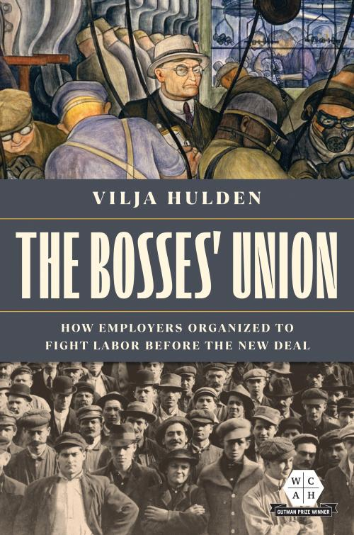

# Documentation of digital work in The Bosses' Union

This is a repository for some of the digital work included in my book. The book is now out from the University of Illinois Press. Thanks to a TOME (Toward an Open Monograph) grant, you can download it for free! Here's the link to the publisher's site: https://www.press.uillinois.edu/books/?id=p086922  - click on "Supplemental links" to download the book.

The folder names are pretty self-explanatory. Note that some aspects of the digital work is documented here more extensively than others. For example, you could probably use the ngram documentation as step-by-step instructions for creating the same image yourself, plus it discusses the various caveats of ngrams in a fair amount of detail. By contrast, the laborpapers folder doesn't contain a ton of explanation, partly because it's described in greater detail in the book and partly because it would take me a lot more work to go through all that step by step since it's not something I'm a super-expert in and it was a while ago that I wrote the scripts and did the analysis. On the whole, though, I've tried to make things as transparent as possible and pretty much all scripts and data that underlie the digital work in the book are here.

